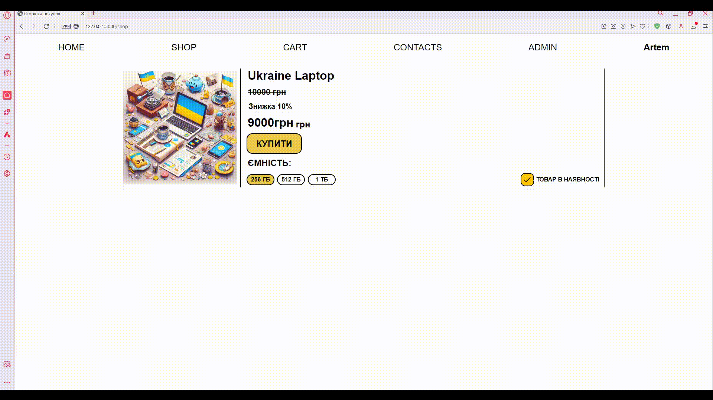
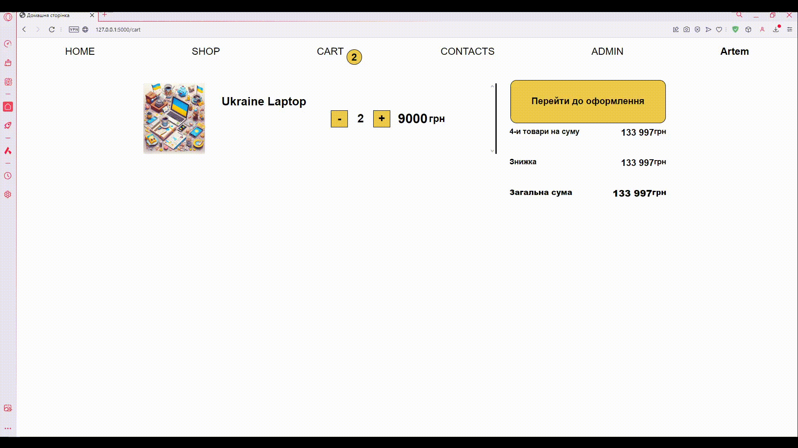
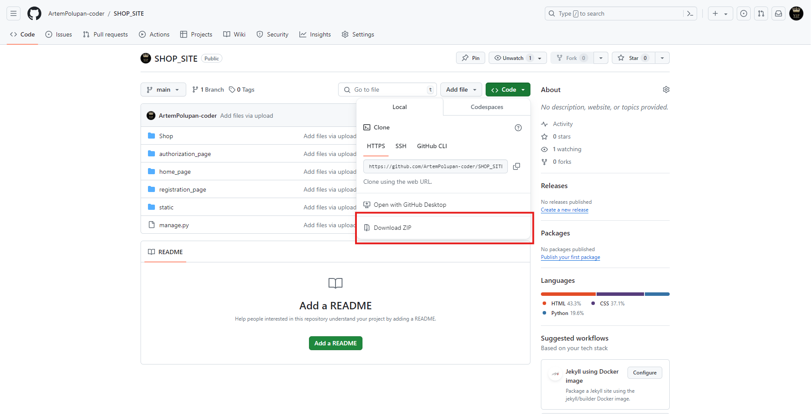

# Онлайн Магазин

***
#### Розробники проекту:
- Артем Полупан/Artem Polupan (https://github.com/ArtemPolupan-coder)
- Назар Зозуля/Nazar Zozulya (https://github.com/Nazar-Zozulya)
- Архип Гончар/Archip Gonchar (https://github.com/Arhip-ops)
***
Цей проект є **повноцінним** онлайн-магазином/This project is a **full** online store
З функціями/With features:
- додавання/зміннення/видалення товару, через адмін-панель/adding/modifying/deleting goods through the admin panel

- додавання товару в кошик/adding a product to the cart

- оформлення замовлення/order placement 

- надсилання замовлення на пошту замовника/sending the order to the customer's mail

  
🤖 Також тут є телеграм бот-менеджер. За допомогою якого можна: з легкістю давати або забирати права адміністратора; додавати/видаляти товар; отримувати всю інформацію про всі товари, замовлення та користувачів; ну і звісно відмічати замовлення як виконане/There is also a Telegram bot manager. With the help of which you can: easily give or take away administrator rights; add/remove products; get all the information about all products, orders and users; and, of course, mark the order as completed  

Данний проект має всі необхідні функції для того щоб зробити пофноцінний веб сайт для замовника/This project has all the necessary functions to make a valuable website for the customer
***
# Технології ⚙️
- Flask - основа/foundation
- JavaScript - фронтенд/frontend
- Html + CSS - стилі та верстка/styles and layout
- Telebot - телеграм бот/telegram bot
- Jinja - Шаблони та спадкування/Templates and inheritance
- SQLite3 - Бази даних та їх моделі/Databases and their models 
***

Для того щоб протестувати цей проект є 3 способи/There are 3 ways to test this project:
>**УВАГА БОТ ПРАЦЮВАТИМЕ ЛИШЕ, ЯКЩО ВИ ЗАПУСКАЄТЕ ЙОГО ЛОКАЛЬНО/NOTE THE BOT WILL ONLY WORK IF YOU RUN IT LOCALLY**
>Адмін акаунт на сайті/Admin account on the site
username: Admin
email: admin@gmail.com
password: admin
1. **Перейти на сайт за посиланням/Go to the site at the link [http://artpan.pythonanywhere.com]**
2. **Запустити локально, для цього/Run locally, to do this:**
- Перейдіть за наступним посиланням в репозиторій/Follow the following link to the repository [https://github.com/ArtemPolupan-coder/ONLINE_SHOP.git]
  > Якщо ви вже тут попередній крок не виконуємо/If you are already here, do not perform the previous step
- Натисніть на зелену кнопку "Code"/Click on the green "Code" button
- Натисніть на зелену кнопку "Code"

- Далі у вікні яке відкрилося натисніть "Download ZIP"/Next, in the window that opens, click "Download ZIP"

- Після чого збережіть та розпакуйте архів/Then save and unzip the archive 
- Встановіть пайтон за наступним посиланням/Install the python at the following link [https://www.python.org/downloads/]
  > Якщо у вас встановлений пайтон попередній крок ви пропускаєте/If you have Python installed, skip the previous step
- Встановіть VSCode за настпним посиланням/Install VSCode from the following link [https://code.visualstudio.com/download]
  > Якщо у вас встановлений VSCode попередній крок ви пропускаєте/If you have VSCode installed, you skip the previous step
- Після чого відкрийте папку в VSCode/Then open the folder in VSCode 
- Далі натисніть в верхньому лівому куті "Termainal" "New Termanal"/Then click in the upper left corner of "Terminal" "New Terminal"
- І встановіть всі модулі написавши/And install all the modules by writing `pip install flask flask_sqlalchemy flask_migrate flask_mail flask_login telebot`
- Після чого запустіть файл `manage.py`, та перейдіть за посиланням яке з'явилося в терміналі/Then run the file `manage.py`, and follow the link that appears in the terminal
3. **Запуск віддалено (на PythonAnywhere)/Run remotely (on PythonAnywhere)**
- Перейдіть за посиланням [https://www.pythonanywhere.com] та зареєструйтесь/авторизуйтесь, натиснувши відповідну кнопку в верхньому правому куті/Follow the link [https://www.pythonanywhere.com] and register/log in by clicking the appropriate button in the upper right corner
- Створіть нову консоль "Bash"/Create a new "Bash" console

- В ній пропишіть/In it, write down `git clone https://github.com/ArtemPolupan-coder/ONLINE_SHOP.git`
- Next mkvirtualenv [назва віртуального оточення] --python=python3.10
- Далі встановлюємо модулі написавши/Next, install the modules by writing `pip install flask flask_sqlalchemy flask_migrate flask_mail flask_login telebot`
- Дублюємо вкладку з консолюю та в одній з них виходимо на головну сторінку, після чого натискаємо в правому верхньому куті "Files"/Duplicate the tab with the console and in one of them go to the main page, then click "Files" in the upper right corner

- Там шукаємо файл `Online_Shop/Shop/data.db`, та видаляємо його/There we look for the file `Online_Shop/Shop/data.db`, and delete it
- Потім шукаємо папку `Online_Shop/Shop/migrations`, і також видаляємо/Then we look for the folder `Online_Shop/Shop/migrations`, and also delete
- Повертаємося на вкладку з консоллю та пишемо `cd Shop`/Return to the tab with the console and write `cd Shop`.
- Далі по черзі/Next in order `flask --app settings db init`, `flask --app settings db migrate`, `flask --app settings db upgrade`
- Потім знову переходимо на головну сторінку та обираємо в верхньому правому куті "Web"/Then go back to the main page and select "Web" in the upper right corner
- Після чого задаємо шлях "Working dirictory" та "Virtualenv"/Then set the path "Working directory" and "Virtualenv"

- Потім натискаємо на WSGI configuration file/Then click on the WSGI configuration file
 
- І в цьому файлі на 16 рядку пишемо `from Shop import shop_app as application`, і натискаємо "Save"/And in this file, on line 16, write `from Shop import shop_app as application`, and click "Save"
 
І тепер якщо ми перейдемо назад до Web і натиснемо на цей синій напис на перекине на наш сайт/And now, if we go back to the Web and click on this blue label, it will take us to our site

***
# Структура
 
`admin_app` -- адмін-панель сайту/site admin panel
`autorization_page` -- відповідає за авторизацію користувача/is responsible for user authorization
`bot_app` -- відповідає за бота-манеджера/is responsible for the bot manager
`cart_page` -- кошик та взаємодія з ним/shopping cart and interaction with it
`home_page` -- домашня сторінка/home page
`registration_page` -- відповідає за реєстрацію користувача/is responsible for user registration
`Shop` -- головний додаток проекту який надсилає емейл, створює базу данних, та реєструє усі нші додатки/the main project application that sends emails, creates a database, and registers all other applications
`shop_page` -- сторінка покупок/shopping page
***
## Створення головного додатку/Creating the main application
 
> За допомогою класу Flask створюється новий головний додаток(проект), а також за допомогою додаткових модулів відбувається ініціалізація міграцій з базою даних/Using the Flask class, a new main application (project) is created, and with the help of additional modules, migrations with the database are initialized

## Створення інших додатків/Create other applications 
 
> Тут відбувається щось схоже тільки за допомогою класу Blueprint, та не "головний додаток", а звичайний/Here, something similar happens only with the Blueprint class, and not the "main application", but a regular one

## Реєстрування сторінок/Registering pages
 

> Тут ми створюмо нове посилання для нашої сторінки та реєструємо його в проекті/Here we create a new link for our page and register it in the project

## Конфігурація емейлу/Email configuration

> Задаємо всі конфігурації які потрібні для відправки/Set all the configurations you need to send

## Конфігурація авторизації/Authorization configuration 

> Задаємо всі налаштування для авторизації/Set all the settings for authorization

## Сторінка покупок

> Генеруємо товар з бази даних, автоматично задаючи значення 

## Сторінка реєстрації/Shopping page

>Створюємо форму з усіма данними користувача, за допомогою якої записуємо все в базу даних/Create a form with all the user's data, with the help of which we record everything in the database

## Сторінка кошику/Cart page 

> Генеруємо кошик з cookie файлів, а також робимо модальне вікно для оформлення замовленя/We generate a shopping cart from cookies, as well as make a modal window for placing an order 

## Сторінка авторизації/Authorization page

> Робимо форму для вводу усіх даних, щоб в подальшому їх перевіряти та зробити відповідну дію/We make a form for entering all the data so that we can check it later and take the appropriate action

## Сторінка адмін-панелі/Admin panel page
 

> Виводимо всі товари які в нас є з бази даних та до них додаємо кнопки, форми, для того, щоб в подальшому через форми їх змінити/видалити/створити/We display all the products that we have from the database and add buttons, forms to them in order to change/delete/create them through the forms in the future
***
# Файли views
Ці файли виконують одну з найважливіших ролей в проекті роблячи всі функції для певної задачі/These files play one of the most important roles in the project, performing all the functions for a specific task

## Views сторінки покупок

> Перевіряємо авторизацію та статус користувача та відмальовуємо сторінку покупок/Check the user's authorization and status, and display the shopping page

## Views сторінки реєстрації

> Зчитуємо дані з форми та записуємо нового користувача в базу даних/Read data from the form and add a new user to the database

## Views головної сторінки

> Перевіряємо авторизацію користувача, та додаємо продукт якщо він є/Check user authorization and add the product if it is available

## Views сторінки кошика

> Виводимо продукти з cookie а також оформлюємо замовлення і записуємо його до бази даних, після чого надсилаємо інформацію про замовлення замовнику/We display products from the cookie and place an order and record it in the database, after which we send order information to the customer

## Views сторінки авторизації

> Перевіряємо чи зареєстрований користувач, якщо ні перекидуємо на головну, якщо так то змінюємо статус на "авторизаваний", і додаємо в поточну сесію/Check whether the user is registered, if not, transfer to the main page, if so, change the status to "authorized" and add to the current session

## Views адмін-сторінки

> Перевіряємо чи є зміни, якщо є застосовуємо та перезаписуємо їх, якщо команда видалення видаляємо, а також якщо змінюється назва продукту то змінюємо і назву зображення/Check if there are any changes, if so, apply and overwrite them, if the delete command is deleted, and if the product name changes, change the image name as well
***
# SQLite3 | Бази Даних 
Бази даних як не странно потрібні для того щоб зберігати в них якісь дані в різних форматах (текст, числа, True/False). І SQLite справляється з цим найкраще адже є простішою, зручнішою, та швидшою. В базах даних є різні таблиці (моделі) в яких зберігається інформація про певні об'єкти наприклад: замовлення, користувачів, робітників тощо. А також в кожному стовбчику є неймовірне важливе значення без якого нічого б не працювало, це id. Адже завдяки ньому ми можемо зрозуміти до якого саме елементу ми звертаємося, і відповідно зробити якусь дію/Databases are, oddly enough, needed to store data in various formats (text, numbers, True/False). And SQLite is the best for this because it is simpler, more convenient, and faster. Databases have various tables (models) that store information about certain objects, such as orders, users, employees, etc. And also in each column there is an incredibly important value without which nothing would work, this is the id. Thanks to it, we can understand which element we are referring to, and accordingly take some action

***
# Моделі Проекту
Моделі виконують роль таблиць в базі данних які записують в себе певні данні/Models play the role of tables in the database that record certain data

## Модель Користувача

> Всі дані користувача (див. фото)

## Модель продуктів

> Всі дані про продукти (див. фото) 

## Модель замовлення

> Всі дані про замовлення (див. фото)
***
# Проведення міграцій/Conducting migrations
Це потрібно робити для ініціалізації та оновлення бази данних/This must be done to initialize and update the database

#### Щоб це зробити вам треба/To do this, you need to:
1. Перейти в папку Shop, командою/Go to the Shop folder with the command `cd Shop`
2. Далі треба ініціалізувати базу данних написавши/Next, you need to initialize the database by writing `flask --app settings db init`, **ПИШЕТЬСЯ ОДИН РАЗ**/**WRITTEN ONCE**
3. Потім провести самі мірації командою/Then conduct the measurements themselves as a team `flask --app settings db migrate`
4. І оновити базу даних командою/And update the database as a team `flask --app settings db upgrade`
***
# JavaScript проекту
## Cookie.js

> Данний файл додає файли cookie коли ми натискаємо кнопку "Купити"/This file adds cookies when we click the "Buy" button

## plusMinus.js

> Данний файл керує cookie на сторінці кошику, додаючи або віднімаючи кількість товару/This file manages the cookie on the cart page, adding or subtracting the quantity of the product

## admin.js

> функція openDialog відповідає за відкриття діалогових вікон/the openDialog function is responsible for opening dialog boxes

## editImage.js

> функція editImage відповідає за зміну старої на нову картинку/the editImage function is responsible for changing the old image to a new one

## editText.js

> функція editText редагує значення товару (ціну, знижку тощо)/editText function edits product values (price, discount, etc.)

## main.js

> цей файл запускає всі (попередні 3) функції/ this file runs all (previous 3) functions
***
# Висновок/Conclusion
Данний проект був неймовірно корисним для особистого розвитку та для отримання нових навичок професійного рівня, а також ознайомлення з jinja, JavaScript, Flask/This project was incredibly useful for personal development and for acquiring new professional-level skills, as well as for getting acquainted with jinja, JavaScript, Flask
<<<<<<< HEAD
#
